# SemPCA
[](https://doi.org/10.5281/zenodo.6375627)

SemPCA is an artifact of our empirical study: **Try with Simpler – An Evaluation of Improved Principle Component Analysis in Log-based Anomaly Detection**.


Table of Contents
=================
* [Project Structure](#project-structure)
* [Datasets](#datasets)
* [Environment](#environment)
* [Reproducibility](#reproducibility)
* [Contact](#contact)
  


## Project Structure

```
├─approaches  		# LogBar main entrance
├─conf	      		# configurations for Drain
├─datasets    		# open source Log datasets, i.e. HDFS, BGL and Spirit
├─entities    		# instances for log data and DL models
├─logs    
├─models      		# LSTM, attention-based GRU, Cluster and PCA models
├─module      		# anomaly detection modules, including classifier, Attention, etc.
├─outputs   	
├─parsers     		# Drain parser
├─preprocessing 	# preprocessing code, data loaders and cutters
├─representations       # log template and sequence representation methods
├─scripts		# running scripts for reproduction
├─utils				
```


## Datasets

We used `3` open-source log datasets, HDFS, BGL, and Spirit.  The table below illustrates some basic information about them.


| Software System | Description                        | Time Span  | # Messages  | Data Size | Link                                                      |
| --------------- | ---------------------------------- | ---------- | ----------- | --------- | --------------------------------------------------------- |
| HDFS            | Hadoop distributed file system log | 38.7 hours | 11,175,629  | 1.47 GB   | [LogHub](https://github.com/logpai/loghub)                |
| BGL             | Blue Gene/L supercomputer log      | 214.7 days | 4,747,963   | 708.76 MB | [Usenix-CFDR Data](https://www.usenix.org/cfdr-data#hpc4) |
| Spirit          | Spirit supercomputer log           | 2.5 years  | 272,298,969 | 37.34 GB  | [Usenix-CFDR Data](https://www.usenix.org/cfdr-data#hpc4) |

You can find the datasets files by doi: 10.5281/zenodo.6375627 or just click the doi badge from the title.
Please note that due to size limitation, the zenodo archive do not include the original log files (e.g., HDFS log file), but it should allow you to run the scripts directly. If anything goes wrong, please download the log files and put it into the corresponding folder(e.g., `datasets/HDFS/HDFS.log` for HDFS log data).

## Environment

To reproduce results in our paper, please try to install the suggested version of key packages. Other packages needed to run our experiments are presented in requirement.txt.

**Key Packages:**
The packages used by logbar are listed below. The version of the cricual ones for reproducibility are specified.  
```angular2html
Python 3.8.3         
hdbscan 0.8.27
verrides 6.1.0
scikit-learn 0.24.2  #(Latest version of scikit-learn is not supported)
PyTorch 1.10.1       #(Please refer to official guidelines.)
Drain3               # https://github.com/IBM/Drain3 Please use `pip install drain3` if conda install fails.)
tqdm
numpy
regex
pandas
scipy
```
We have prepared a `requirements.txt` for quick installation. 
Please be noted that PyTorch is not included in the file, you may need to visit its [official site](https://pytorch.org/) for more information. 

**NB:** Since there is some known issue about joblib, **scikit-learn > 0.24 is not supported here**. We'll keep watching. 


## Reproducibility

Follow the steps below in order to reproduce our experiment results.

- **Step 1:** Create a directory under the `datasets` folder **using a unique and memorable name **(e.g. HDFS or BGL).
- **Step 2:** Move a target log file with the extension of .log (in plain text, with each row containing one log message) into the folder created in step 1.
- **Step 3:** Download the  `glove.6B.300d.txt` from [Stanford NLP word embeddings](https://nlp.stanford.edu/projects/glove/), and put it under the `datasets` folder.
- **Step 4:** Enter the `scripts/HDFS` folder, and run  `PCA_PlusPlus.sh` to perform an anomaly detection on HDFS by PCA++. 
Other techniques can be executed by the corresponding scripts in a similar way.

## Contact

authors are anonymous at the current stage.

| Name | Email Address |
| ---- | ------------- |
|      |               |
|      |               |
|      |               |

\* *corresponding author*


## 论文复现

### 降低数据集规模
在复现工作中，其中一个工作是通过降低数据集的规模来模拟数据不足的情况下不同算法的表现。
为了实现这一点，我们需要对代码进行一些修改，在分割数据集的时候只选取部分训练数据。需要修改的位置在 `preprocessing/datacutter/SimpleCutting.py`，修改其中两个将数据集分割的函数即可。这里修改的是 `cut_by_613()`
```python
# 只加载1%的数据
train_len = int(train_split * 0.01)
train_begin = random.randint(0, train_split-train_len-1)
train = train[train_begin:train_begin+train_len]
```

### 复现过程中的一些问题
在使用 Spirit 数据集复现该实验时，出现了内存 OOM 的问题，而且在复现的时候 CPU 压力十分大。重新检查了一下代码，推测有可能是`preprocessing/dataloader/SpiritLoader.py`中加载数据有问题。Spirit 数据集的大小为 37.34GB，`SpiritLoader.py`中使用python实现了数据集加载方法，而且其中大量使用了字典类型的变量，而这也导致了CPU和内存的压力过大。


### 复现结果
#### HDFS
PCA
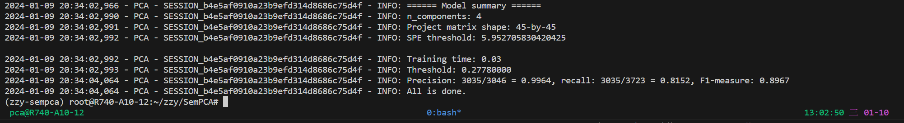
LogCluster
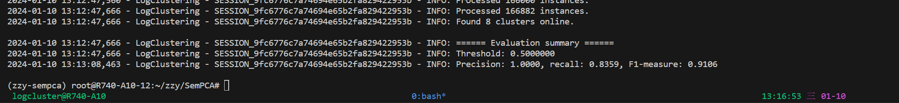
DeepLog
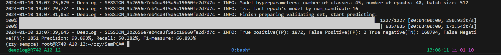
LogAnomaly
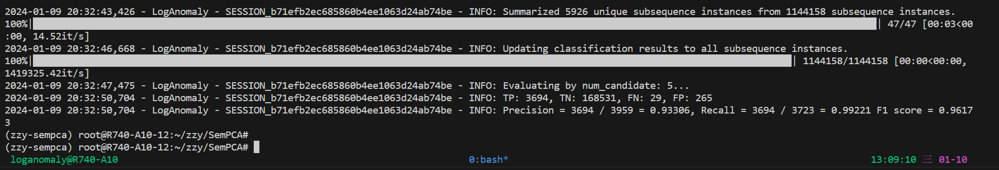
PLELog
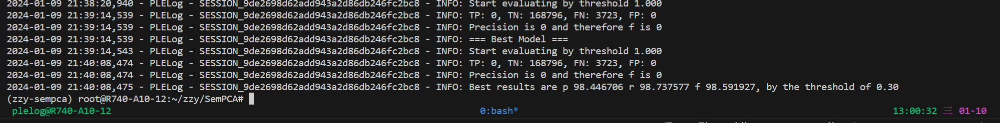
LogRobust
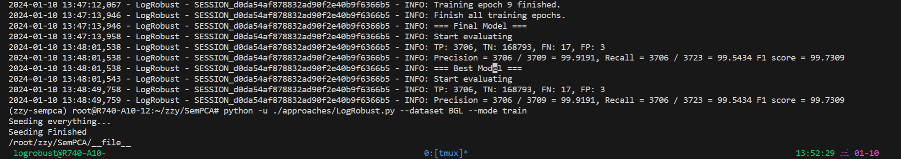
SemPCA
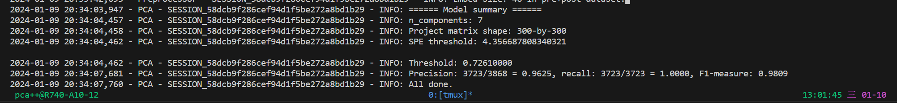

#### BGL
PCA
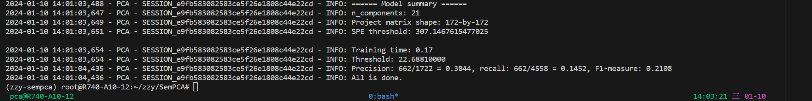
LogCluster
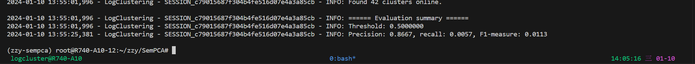
DeepLog
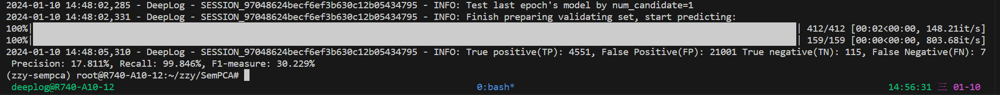
LogAnomaly
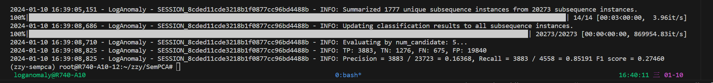
PLELog
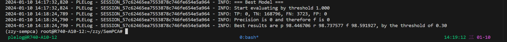
LogRobust
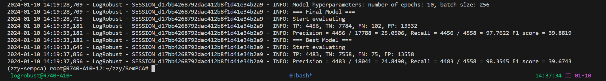
SemPCA
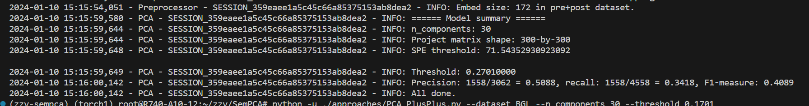